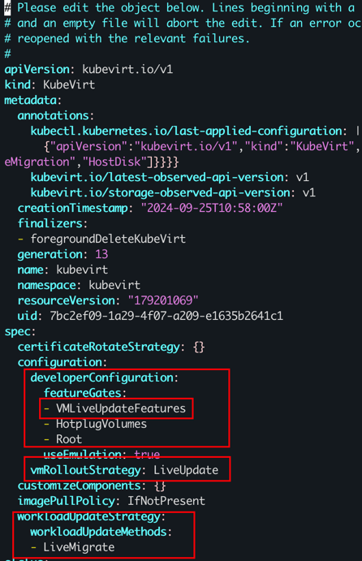

- https://kubevirt.io/user-guide/compute/memory_hotplug/

- 


```bash
root@master01:/home/ubuntu/yst# kc get vmi cirros-vm -ojson| jq .status.memory
{
  "guestAtBoot": "256Mi",
  "guestCurrent": "256Mi",
  "guestRequested": "256Mi"
}
root@master01:/home/ubuntu/yst# kc patch vm cirros-vm -p='[{"op": "replace", "path": "/spec/template/spec/domain/memory/guest", "value": "1024Mi"}]' --type='json'
virtualmachine.kubevirt.io/cirros-vm patched
root@master01:/home/ubuntu/yst# kc get vmi cirros-vm -ojson| jq .status.memory
{
  "guestAtBoot": "256Mi",
  "guestCurrent": "256Mi",
  "guestRequested": "256Mi"
}
```

发现没能实现热插拔memory，原因是linux kenernal 版本得大于5.16
相关issue：https://github.com/kubevirt/kubevirt/issues/12101